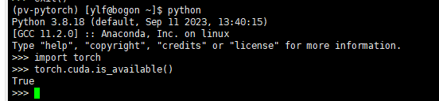

# Picture4Video

### 环境安装
+ Docker安装
  - 安装docker 的Windows版本,下载网址：https://www.docker.com/
+ Milvus安装
  - 采用Milvus版本2.2.9即code/milvus下的docker-compose.yml
  - Milvus可视化管理工具 Attu: https://github.com/zilliztech/attu/blob/main/doc/zh-CN/attu_install-docker.md
+ 项目环境配置
  安装annconda, 后创建python版本为3.8的虚拟环境，之后在该虚拟环境内安装以下包
  - pip install torch==2.0.0 torchvision==0.15.1 torchaudio==2.0.1 -i https://pypi.tuna.tsinghua.edu.cn/simple
	- torch安装验证 
	
  - 安装onnx， pip install -i https://pypi.tuna.tsinghua.edu.cn/simple onnx
  - 安装onnxruntime-gpu, pip install onnxruntime-gpu -i https://pypi.tuna.tsinghua.edu.cn/simple
  - 安装opencv，pip install opencv-python==4.8.0.74 -i https://pypi.tuna.tsinghua.edu.cn/simple
  - 安装av, pip install av==10.0.0 -i https://pypi.tuna.tsinghua.edu.cn/simple
  - 安装pymilvus, 版本要符合跟Milvus版本的对于关系，pip install pymilvus==2.2.9 -i https://pypi.tuna.tsinghua.edu.cn/simple 
  - 安装PyMySQL, pip install PyMySQL==1.1.0 -i https://pypi.tuna.tsinghua.edu.cn/simple
  - 安装pyyaml，pip install pyyaml==6.0

### 项目结构
+ code/model 存放模型权重
+ code/RetrievalVideos 存放待进行视频在库检索的视频
+ code/milvus/docker-compose.yml 存放Milvus信息
+ code/Videos 存放待提取关键帧的视频
+ code/pics 存放待检索的的图片
+ code/utils 包存放使用到的工具类
+ code/Frames 存放所有视频的关键帧（该文件夹会自动生成）
+ code/SFrames 存放待进行相似度检索的两个关键帧（该文件夹会自动生成）
+ code/data.txt 存储frame_id和frame_path的对应关系，用于后续的Insert2Milvus.py。
+ code/Create.py 调用CreateAndInsert2Database方法提取视频关键帧并将相关信息保存至关系型数据库中。
+ code/Insert2Milvus.py 调用Insert2Milvus方法根据data.txt文件读取视频关键帧并将其转换成特征向量，传入Milvus数据库中存储。
+ code/Search.py 调用SearchVideoByOnePic方法进行以1张图片搜视频。
+ code/Delete.py 调用delete_frame_by_v_id方法根据视频id列表删除Milvus数据库中相应的视频的关键帧的特征向量。
+ code/VideoRetrieval.py 调用VideoRetrieval方法根据视频路径列表进行视频在库检索。
+ code/Similarity.py 计算两个关键帧之间的相似度。

### 参考资料
+ [企业级的以图搜图实战——milvus+minio+gradio+resnet(知乎帖子)](https://zhuanlan.zhihu.com/p/591672698)
  - [项目地址](https://github.com/wp931120/picSearch)
+ [milvus官方文档](https://milvus.io/docs)
  - [连接Milvus](https://milvus.io/docs/manage_connection.md)
  - [数据库管理](https://milvus.io/docs/manage_databases.md)
  - [表管理](https://milvus.io/docs/create_collection.md)
  - [数据管理](https://milvus.io/docs/insert_data.md)
  - [创建索引](https://milvus.io/docs/build_index.md)
  - [向量搜索](https://milvus.io/docs/search.md)
+ [视频流编码方法-H264(博客)](https://blog.csdn.net/hello_1995/article/details/122091747)
+ [提取视频关键帧算法：基于H264视频流编码](https://pyav.org/docs/8.0.1/cookbook/basics.html#saving-keyframes)（pyav库）
+ [Python连接MySQL数据库方法介绍(知乎帖子)](https://zhuanlan.zhihu.com/p/79021906)
+ [视频在库检索-哈希编码(博客)](https://blog.csdn.net/weixin_50153843/article/details/131027348)  

  
